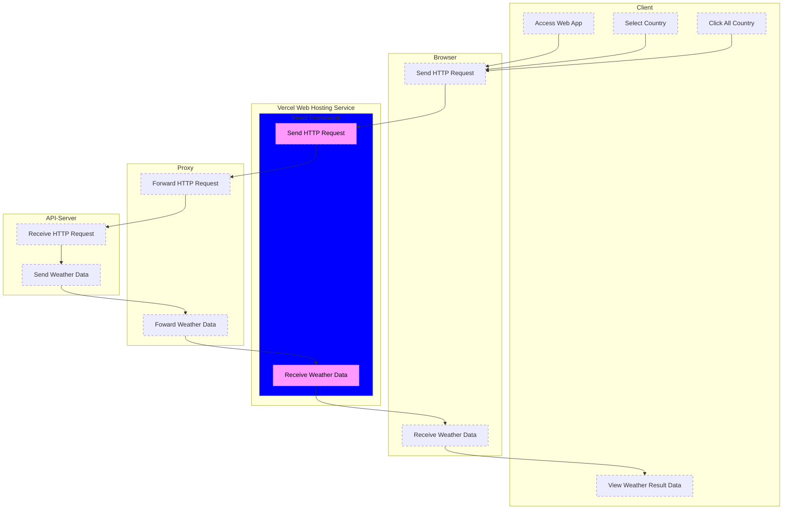

# Corona Tracker using React framework
## 概要
[「はじめてさわるReact & JavaScript: JavaScriptとReactの使い方が同時にわかる本(React入門)」](https://www.amazon.co.jp/gp/product/B09693ZJCV) を参考に作成しました。

React を使用し書籍の作者が作成した Corona Tracker API サーバーからデータを取得し  
表示するWebアプリです。
URL隠蔽の目的で中間にプロキシを経由させています。

## 構成図

## 動作
### パターン1
1. Webアプリへアクセスする
1. デフォルトでは日本のコロナ感染者情報を表示する
* 表示項目
	* 日付
	* 新規感染者
	* 感染者数
	* 新規回復者
	* 回復者総数

### パターン2
1. Webアプリへアクセスする
1. 国を選択する
1. 選択した国のコロナ感染者情報を表示する

### パターン3
1. Webアプリへアクセスする
1. 「世界の感染状況」をクリックする
1. 世界のコロナ感染者情報を表示する
* 表示項目
	* 国名
	* 新規感染者
	* 感染者総数
